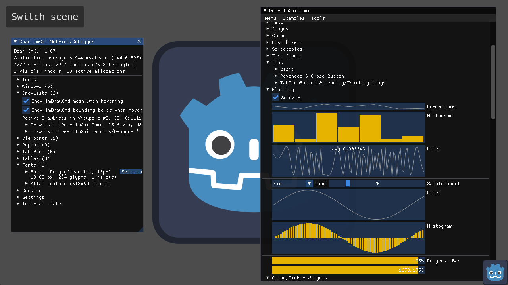

# Dear ImGui plugin for Godot 4 (C#)




Dear ImGui is a popular library for rapidly building tools for debugging and development. This plugin, with the aid of [ImGui.NET](https://github.com/mellinoe/ImGui.NET), allows you to use ImGui in Godot with C#.

After installing the plugin, usage is as simple as this:
```csharp
public partial class MyNode : Node
{
    public override void _Process(double delta)
    {
        ImGui.Begin("ImGui on Godot 4");
        ImGui.Text("hello world");
        ImGui.End();
    }
}
```

Download

[](https://github.com/pkdawson/imgui-godot/archive/refs/tags/v3.5.2.zip)

## Getting Started

### Demo

Click `Build` in the top right, then run the project.

### Your project

1. Create a project and, if you haven't already added some C# code, use `Project > Tools > C# > Create C# solution`.

2. [Install the plugin](https://docs.godotengine.org/en/stable/tutorials/plugins/editor/installing_plugins.html) by copying over the `addons` folder. Or [use Chicken](#package-managers).

3. In Visual Studio or another IDE, open the solution and allow unsafe code, and install `ImGui.NET` with NuGet. Save and return to Godot.

    (If you prefer to manually edit the .csproj instead, refer to the demo csproj for the necessary modifications.)

4. Back in the Godot editor, click `Build`.

5. Enable the plugin in `Project > Project Settings > Plugins`.

6. Write code!

## Usage

In any Node's `_Process` method, use `ImGuiNET` to create your GUI. Just don't set the `ProcessPriority` in any of your Nodes to either `int.MinValue` or `int.MaxValue`.

You can also connect to the `ImGuiLayout` signal, and use ImGui in the method which handles that signal:
```csharp
ImGuiLayer.Connect(OnImGuiLayout);
```

### ImGuiLayer

If you want to customize fonts or other settings, open the scene `res://addons/imgui-godot/ImGuiLayer.tscn`

Use the `Font` and `FontSize` properties to add custom fonts. Use the `Visible` property to show/hide the GUI as needed (when not visible, it uses almost zero resources). Change the `Layer` if you need to render anything on top of the GUI.

### Widgets

These methods should only be called within `_Process` or an `ImGuiLayout` callback.

`Image` and `ImageButton` are simple wrappers for your convenience.

`SubViewport` displays an interactive viewport which receives input events. Be sure to change your SubViewport's `Update Mode` to **Always**.

### ImGuiGD

This is the rest of the public API. You typically won't need to call any of these methods directly.

That's about it. Everything else is provided by ImGui itself, via ImGui.NET.


## Package managers

[Chicken](https://github.com/chickensoft-games/Chicken/) is a dotnet tool that can manage Godot addons with just a little configuration. Use something like:

```json
{
  "addons": {
    "imgui-godot": {
      "url": "https://github.com/pkdawson/imgui-godot",
      "checkout": "v3.5.2",
      "subfolder": "addons/imgui-godot"
    }
  }
}
```


## Credits

Code written by Patrick Dawson and contributors, released under the MIT license

Godot Logo (C) Andrea Calabró, distributed under the terms of the Creative Commons Attribution 4.0 International License (CC-BY-4.0 International) https://creativecommons.org/licenses/by/4.0/

Hack font distributed under the [MIT license](https://github.com/source-foundry/Hack/blob/master/LICENSE.md)

M PLUS 2 font licensed under the SIL Open Font License, Version 1.1.

This plugin's functionality relies heavily on [ImGui.NET](https://github.com/mellinoe/ImGui.NET) by Eric Mellino
